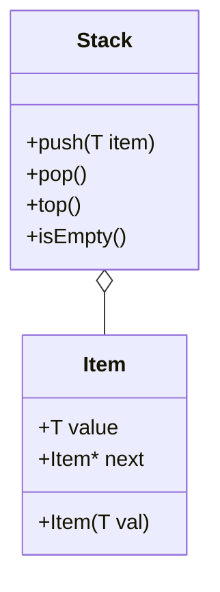
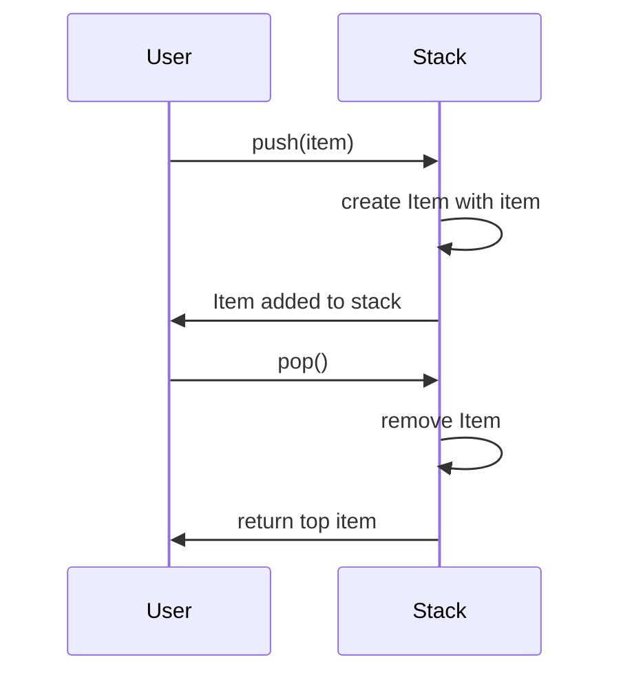

# Implementacja Generic Stack w C++

## Opis

Poniższy kod przedstawia implementację stosu w C++ z zastosowaniem abstrakcyjnej klasy bazowej kontenera oraz klasy `Item<T>`.

### Abstrakcyjna klasa bazowa kontenera

```cpp
template<typename T>
class Container {
public:
    virtual void push(const T& item) = 0;
    virtual T pop() = 0;
    virtual T top() const = 0;
    virtual bool isEmpty() const = 0;
    virtual ~Container() {}
};
```

### Klasa Item<T>

```cpp
template<typename T>
class Item {
public:
    T value;
    Item<T>* next;
    
    Item(const T& val) : value(val), next(nullptr) {}
};
```

### Klasa Stack

```cpp
template<typename T>
class Stack : public Container<T> {
private:
    Item<T>* topNode;

public:
    Stack() : topNode(nullptr) {}
    
    void push(const T& item) override {
        Item<T>* newItem = new Item<T>(item);
        newItem->next = topNode;
        topNode = newItem;
    }
    
    T pop() override {
        if (isEmpty()) throw std::underflow_error("Stack is empty.");
        T item = topNode->value;
        Item<T>* temp = topNode;
        topNode = topNode->next;
        delete temp;
        return item;
    }
    
    T top() const override {
        if (isEmpty()) throw std::underflow_error("Stack is empty.");
        return topNode->value;
    }
   
    bool isEmpty() const override {
        return topNode == nullptr;
    }

    ~Stack() {
        while (!isEmpty()) {
            pop();
        }
    }
};
```

## Diagramy UML i operacji stosu

### Diagram klas (UML)



### Przepływ operacji na stosie


